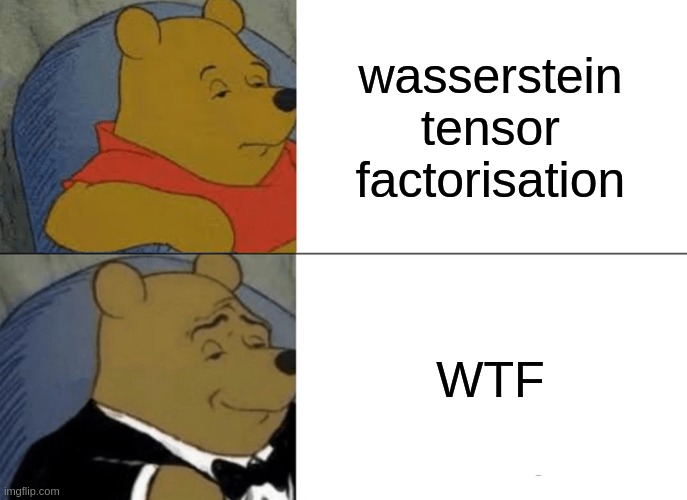

# wtf: Wasserstein Tensor Factorisation
## Non-negative matrix and tensor factorisations with a smoothed Wasserstein loss 



This repository contains a basic implementation of the method described in the article "Non-negative matrix and tensor factorisations with a smoothed Wasserstein loss".

## Requirements
 - PyTorch
 - CUDA-compatible GPU (e.g. use [Colab](http://colab.research.google.com/)) for efficient autodiff

## Instructions
 - Clone this repo: `git clone https://github.com/zsteve/wtf.git`

## Citing 
 - If you find this work relevant to your research project, please cite the preprint

```
Zhang, S. Non-negative matrix and tensor factorisations with a smoothed Wasserstein loss 
```
